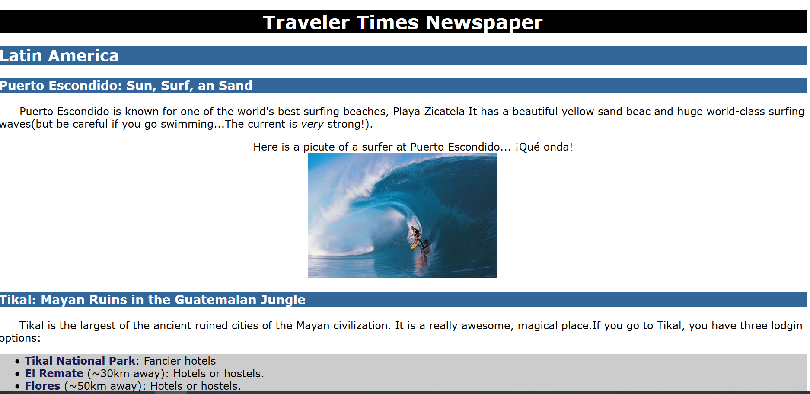
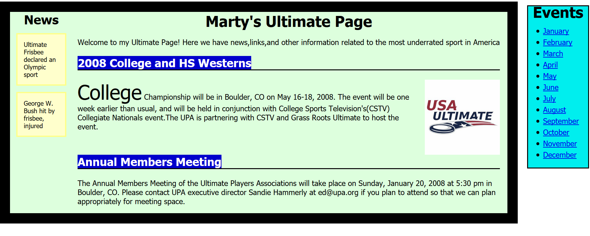
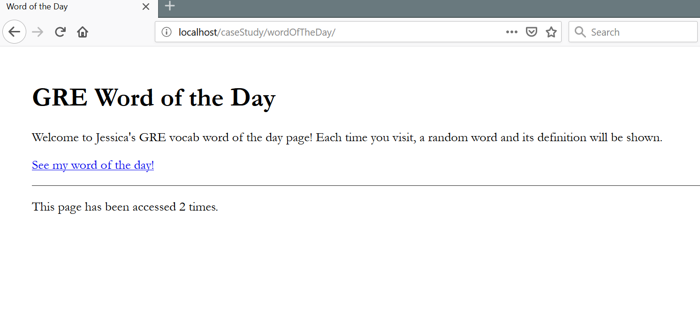
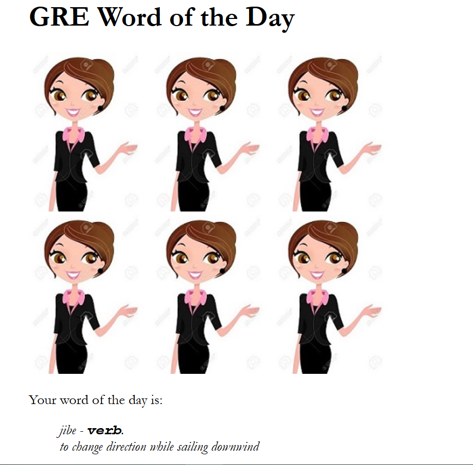
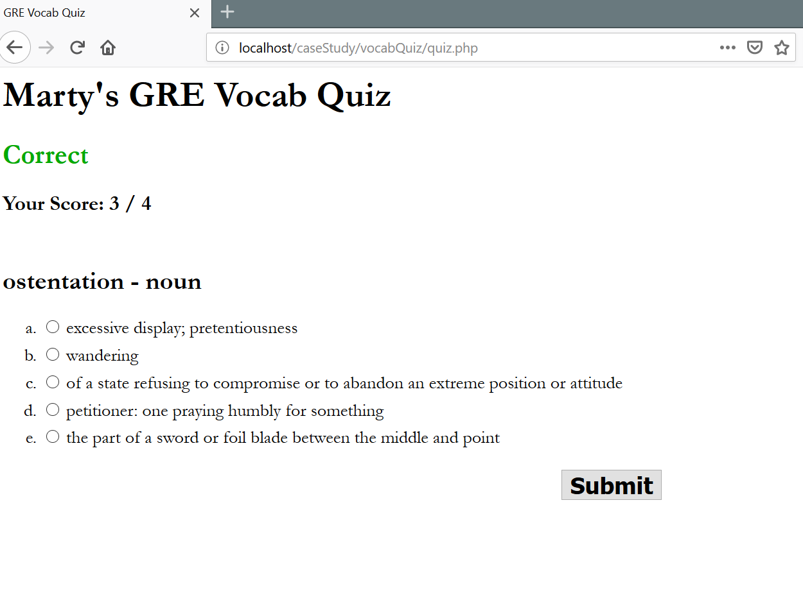

This is where I practiced all the case studies from the book <em>"Web Programming Step by Step" 2nd edition</em> by Marty Stepp Jessica Miller, and Victoria Kirst.
The purpose is to practice more of web desgin through practical examples.

Case 1: Traveler Times

Case 2: Ultimate Frisbee

Case 3: Word of the Day

Case 4 : Vocal Quiz

Date:11/7/2018